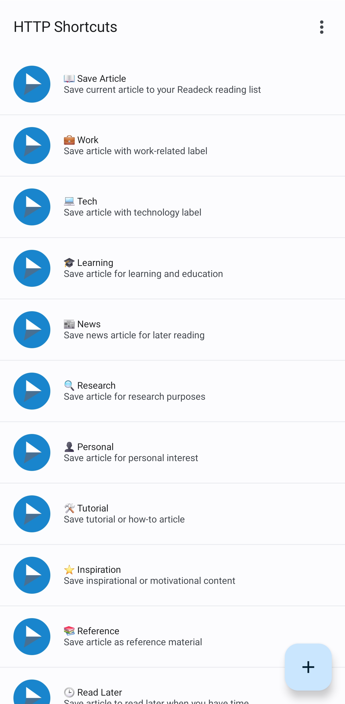

# Readeck Shortcuts Configuration Generator

This template system allows you to generate custom Readeck shortcuts configurations with your own labels and authentication tokens. All label IDs are automatically generated as UUIDs at runtime.

## Project Structure

```
readeck/
├── src/
│   └── generate_config.py          # Main Python script
├── templates/
│   └── shortcuts-template.json     # Base template with placeholders
├── examples/
│   └── example-config.json         # Example configuration file
├── docs/
│   └── (documentation files)
└── README.md                       # This file
```

## Files Overview

- [`src/generate_config.py`](src/generate_config.py) - Python script to generate custom configurations
- [`templates/shortcuts-template.json`](templates/shortcuts-template.json) - Base template with placeholders
- [`examples/example-config.json`](examples/example-config.json) - Example configuration file

## Quick Start

> 🚀 **New to this project?** Check out our [Getting Started Guide](docs/GETTING_STARTED.md) for a step-by-step walkthrough!

### Method 1: Using Configuration File

1. Copy [`examples/example-config.json`](examples/example-config.json) and customize it:

   ```json
   {
     "authToken": "YOUR_READECK_AUTH_TOKEN_HERE",
     "serverUrl": "http://localhost:8090",
     "defaultLabel": "inbox",
     "customLabels": [
       {
         "label": "Work",
         "name": "💼 Work",
         "iconName": "flat_color_briefcase_2"
       }
     ]
   }
   ```

2. Generate your configuration:
   ```bash
   python src/generate_config.py --config your-config.json --output my-shortcuts.json
   ```

### Method 2: Using Command Line

```bash
python src/generate_config.py \
  --auth-token "YOUR_TOKEN_HERE" \
  --server-url "http://your-server:8090" \
  --labels "Work,Tech,Personal,News" \
  --output my-shortcuts.json
```

## Configuration Options

### Required

- **authToken**: Your Readeck API authentication token

### Optional

- **serverUrl**: Readeck server URL (default: `http://localhost:8090`)
- **defaultLabel**: Default label for the main save shortcut (default: `inbox`)
- **customLabels**: Array of custom label configurations

### Custom Label Configuration

Each custom label can have the following properties:

```json
{
  "label": "Work", // Required: The actual label text
  "name": "💼 Work", // Optional: Display name for the shortcut
  "iconName": "flat_color_briefcase_2", // Optional: Icon for the shortcut
  "description": "Save article with work label", // Optional: Shortcut description
  "successMessage": "💼 Work article saved!", // Optional: Success toast message
  "failureMessage": "❌ Failed to save work article." // Optional: Failure toast message
}
```

## Command Line Usage

```bash
python src/generate_config.py [OPTIONS]

Options:
  --config, -c          Path to JSON configuration file
  --template, -t        Path to template file (default: templates/shortcuts-template.json)
  --output, -o          Output file path (default: shortcuts-generated.json)
  --auth-token          Readeck API authentication token
  --server-url          Readeck server URL (default: http://localhost:8090)
  --default-label       Default label for articles (default: inbox)
  --labels              Comma-separated list of custom labels
  --help, -h            Show help message
```

## Examples

### Basic Usage with Simple Labels

```bash
python src/generate_config.py \
  --auth-token "AKSQY1D4j7WyAoRmDHnGVmQKvjd9SovBtUtx4bcaZAp1GUBC" \
  --labels "Work,Tech,Personal"
```

### Advanced Usage with Configuration File

```bash
python src/generate_config.py --config advanced-config.json
```

Where `advanced-config.json` contains:

```json
{
  "authToken": "AKSQY1D4j7WyAoRmDHnGVmQKvjd9SovBtUtx4bcaZAp1GUBC",
  "serverUrl": "http://10.0.3.250:8090",
  "defaultLabel": "inbox",
  "customLabels": [
    {
      "label": "Work",
      "name": "💼 Work Projects",
      "iconName": "flat_color_briefcase_2",
      "description": "Save work-related articles and documentation",
      "successMessage": "💼 Work article saved to your reading list!",
      "failureMessage": "❌ Failed to save work article. Check your connection."
    },
    {
      "label": "Learning",
      "name": "🎓 Study Material",
      "iconName": "flat_color_graduation_cap_2",
      "description": "Save educational content and tutorials"
    }
  ]
}
```

## Generated Configuration

The generator will:

1. **Generate unique UUIDs** for all IDs (category, shortcuts, variables)
2. **Create a base "Save Article" shortcut** using the default label
3. **Add custom label shortcuts** for each specified label
4. **Replace all template placeholders** with actual values
5. **Output a complete shortcuts configuration** ready for import

### Example: HTTP Shortcuts App

Here's what the generated configuration looks like when imported into the HTTP Shortcuts app on Android:



The screenshot shows multiple shortcuts created for different labels like Work, Tech, Learning, News, Research, Personal, Tutorial, Inspiration, and Reference - each with appropriate icons and descriptions.

### Generated Structure

```json
{
  "categories": [
    {
      "id": "generated-uuid-here",
      "name": "📚 Readeck - Save Articles",
      "shortcuts": [
        {
          "id": "generated-uuid-here",
          "name": "📖 Save Article",
          "authToken": "your-token-here"
          // ... complete shortcut configuration
        },
        {
          "id": "generated-uuid-here",
          "name": "💼 Work",
          "authToken": "your-token-here"
          // ... custom label shortcut
        }
        // ... more custom shortcuts
      ]
    }
  ],
  "variables": [
    {
      "id": "generated-uuid-here",
      "key": "readeck_server_url",
      "value": "http://your-server:8090"
    }
    // ... other variables with generated UUIDs
  ]
}
```

## Available Icon Names

Common icon names you can use for your shortcuts:

- `flat_color_bookmark_2` - Bookmark (default save)
- `flat_color_briefcase_2` - Work/Business
- `flat_color_computer_2` - Technology
- `flat_color_graduation_cap_2` - Learning/Education
- `flat_color_newspaper_2` - News
- `flat_color_magnifying_glass_2` - Research
- `flat_color_person_2` - Personal
- `flat_color_tools_2` - Tutorial/How-to
- `flat_color_star_2` - Favorites/Important
- `flat_color_book_2` - Reference
- `flat_color_clock_2` - Read Later
- `flat_color_tag_2` - Generic label

## Template Placeholders

The template uses these placeholders that get replaced during generation:

- `{{CATEGORY_ID}}` - UUID for the category
- `{{AUTH_TOKEN}}` - Your authentication token
- `{{SERVER_URL_VAR_ID}}` - UUID for server URL variable
- `{{DEFAULT_LABEL_VAR_ID}}` - UUID for default label variable
- `{{ARTICLE_TITLE_VAR_ID}}` - UUID for article title variable
- `{{ARTICLE_URL_VAR_ID}}` - UUID for article URL variable
- `{{SHORTCUT_ID_SAVE_ARTICLE}}` - UUID for main save shortcut
- `{{SERVER_URL}}` - Your server URL
- `{{DEFAULT_LABEL}}` - Your default label

## Troubleshooting

### Common Issues

1. **"Auth token is required" error**

   - Make sure to provide `--auth-token` or include `authToken` in your config file

2. **"Template file not found" error**

   - Ensure [`templates/shortcuts-template.json`](templates/shortcuts-template.json) exists in the templates directory
   - Or specify a different template with `--template path/to/template.json`

3. **JSON parsing errors**
   - Check your configuration file for valid JSON syntax
   - Ensure all strings are properly quoted

### Getting Your Auth Token

1. Open your Readeck web interface
2. Go to Settings → API
3. Generate or copy your API token
4. Use this token in the `authToken` field

## License

This template system is provided as-is for generating Readeck shortcuts configurations.
