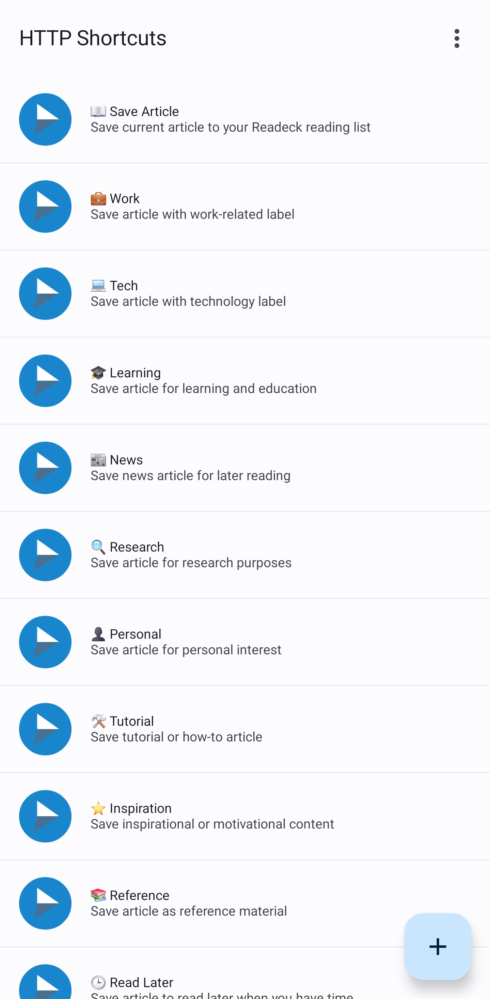

# Getting Started with Readeck Shortcuts Generator

This guide will help you quickly set up and use the Readeck Shortcuts Configuration Generator.

## What You Need

1. **Python 3.6+** installed on your computer
   - Windows users: Use `python3` in WSL or `python` in regular command prompt
   - Linux/Mac users: Use `python3`
2. **Your Readeck API token** (we'll show you how to get this)
3. **Your Readeck server URL** (usually `http://localhost:8090` if running locally)

## Step 1: Get Your Readeck API Token

1. Open your Readeck web interface in your browser
2. Go to **Settings** → **API**
3. Generate or copy your API token
4. Keep this token safe - you'll need it in the next steps

## Step 2: Choose Your Method

### 🚀 Quick Start (Recommended for Beginners)

Use the example configuration file:

1. **Copy the example file:**

   ```bash
   cp examples/example-config.json my-config.json
   ```

2. **Edit your config file** (`my-config.json`) and replace:

   - `YOUR_READECK_AUTH_TOKEN_HERE` with your actual token
   - `http://localhost:8090` with your server URL (if different)

3. **Generate your shortcuts:**

   ```bash
   # For WSL/Linux/Mac users:
   python3 src/generate_config.py --config my-config.json --output my-shortcuts.json

   # For Windows command prompt users:
   python src/generate_config.py --config my-config.json --output my-shortcuts.json
   ```

### ⚡ Command Line Method

If you prefer command line:

```bash
# For WSL/Linux/Mac users:
python3 src/generate_config.py \
  --auth-token "YOUR_TOKEN_HERE" \
  --labels "Work,Personal,Tech,News" \
  --output my-shortcuts.json

# For Windows command prompt users:
python src/generate_config.py \
  --auth-token "YOUR_TOKEN_HERE" \
  --labels "Work,Personal,Tech,News" \
  --output my-shortcuts.json
```

## Step 3: Import to Your Device

1. The script creates a file called `my-shortcuts.json`
2. Import this file into your shortcuts app (like HTTP Shortcuts for Android, Shortcuts app for iOS, etc.)
3. You're ready to save articles to Readeck with custom labels!

### What It Looks Like

Here's an example of what your shortcuts will look like in the HTTP Shortcuts app on Android:



As you can see, each label gets its own shortcut with:

- A descriptive name (like "💼 Work" or "🎓 Learning")
- An appropriate icon
- A clear description of what it does

You can tap any of these shortcuts when viewing a webpage to save it to Readeck with the corresponding label.

## Common Beginner Mistakes

❌ **Don't do this:**

- Forget to replace `YOUR_READECK_AUTH_TOKEN_HERE` with your real token
- Use the wrong server URL
- Run the script from the wrong directory

✅ **Do this instead:**

- Always replace placeholder values with real ones
- Double-check your server URL (usually `http://localhost:8090`)
- Run commands from the project root directory

## Using with HTTP Shortcuts (Android)

The generated configuration works perfectly with the [HTTP Shortcuts app](https://play.google.com/store/apps/details?id=ch.rmy.android.http_shortcuts) for Android:

1. **Install HTTP Shortcuts** from the Google Play Store
2. **Import your configuration** by opening the generated `.json` file in the app
3. **Grant necessary permissions** (network access, etc.)
4. **Test a shortcut** by sharing a webpage to one of your new shortcuts

The app will create a category called "📚 Readeck - Save Articles" with all your custom shortcuts, as shown in the screenshot above.

## Need Help?

- Check the main [README.md](../README.md) for detailed documentation
- Look at [examples/example-config.json](../examples/example-config.json) for configuration examples
- Make sure your Readeck server is running before testing

## What's Next?

Once you have basic shortcuts working:

- Customize label names and icons in your config file
- Add more labels for better organization
- Explore advanced configuration options in the main README
